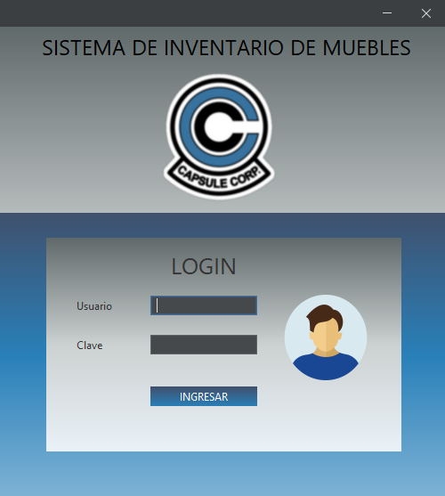
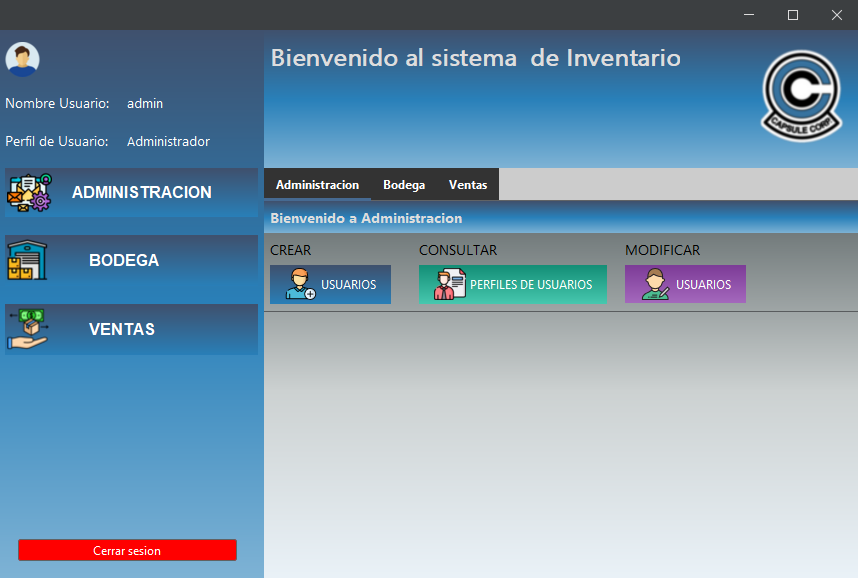
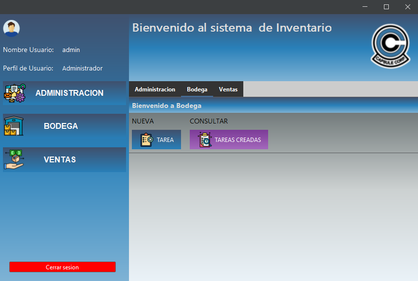
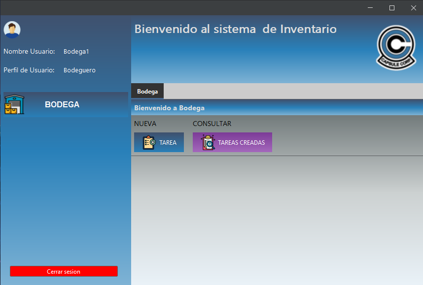

# Sistema de Inventario de Muebles

## 📌 Descripción

Sistema de Inventario de muebles desarrollado en NetBeans usando el lenguaje **Java (JDK 24)** con interfaz gráfica basada en **Java Swing** y conexión a una base de datos en **Microsoft Access**.  
Permite controlar los usuarios, tareas de bodega y procesos de venta, restringiendo el acceso a funcionalidades según el **rol del usuario autenticado**.

---

## 🧑‍💻 Perfiles de Usuario

- **Administrador**
  - Crear, consultar y modificar usuarios.
  - Acceso completo al sistema.
- **Bodeguero**
  - Crear tareas y consultar tareas asignadas.
- **Ventas**
  - Acceso al módulo de ventas únicamente.

---

## 🚪 Pantalla de Inicio de Sesión

La aplicación inicia mostrando una pantalla de login. Según el perfil del usuario, se cargarán distintas opciones del menú lateral.

---

## 🛠️ Panel del Administrador

Al iniciar sesión con un perfil de **Administrador**, se despliega un panel completo con acceso a todas las funcionalidades del sistema, incluyendo la gestión de usuarios, visualización y control de tareas de bodega, y acceso al módulo de ventas.

---

## 📦 Acceso al Módulo de Bodega

El Administrador tiene acceso al **módulo de Bodega**, ya que su perfil posee permisos elevados que permiten supervisar y gestionar todas las áreas del sistema, incluyendo las tareas relacionadas con el inventario físico de muebles.  
Esto es útil para controlar el flujo de productos, asignar tareas y verificar el trabajo realizado por los usuarios del perfil "Bodeguero".

---

## 🔒 Perfil Bodeguero

Cuando se inicia sesión como **Bodeguero**, el sistema limita el acceso y muestra únicamente las opciones correspondientes a ese perfil, como la creación y consulta de tareas asignadas.

---

## 📌 Requisitos

- **Java JDK 24** instalado y correctamente configurado en el sistema.
- **Microsoft Access** (u ODBC configurado si aplica).
- Librerías externas ubicadas en la carpeta `/LIBRERIAS`.
- Base de datos `inventario.accdb` ubicada en la carpeta `/BD`.

---

## ▶️ Cómo Ejecutar el Proyecto

1. Instalar **JDK 24** desde el sitio oficial: [https://jdk.java.net/24/](https://jdk.java.net/24/)
2. Clonar o descomprimir este proyecto en tu equipo.
3. Asegurarse de que las librerías en `/LIBRERIAS` estén agregadas al classpath del proyecto.
4. Configurar correctamente la ruta a la base de datos Access en el código (archivo `.accdb` en `/BD`).
5. Compilar y ejecutar desde tu IDE (NetBeans, IntelliJ, etc.).
6. Iniciar sesión con un usuario válido.

---

## ℹ️ Notas

- Este proyecto se desarrolló con fines académicos.
- El código fuente puede requerir ajustes según la configuración local de la base de datos Access y controladores JDBC disponibles.

---

© 2025 - Desarrollado por **Jonaaxsic**  

